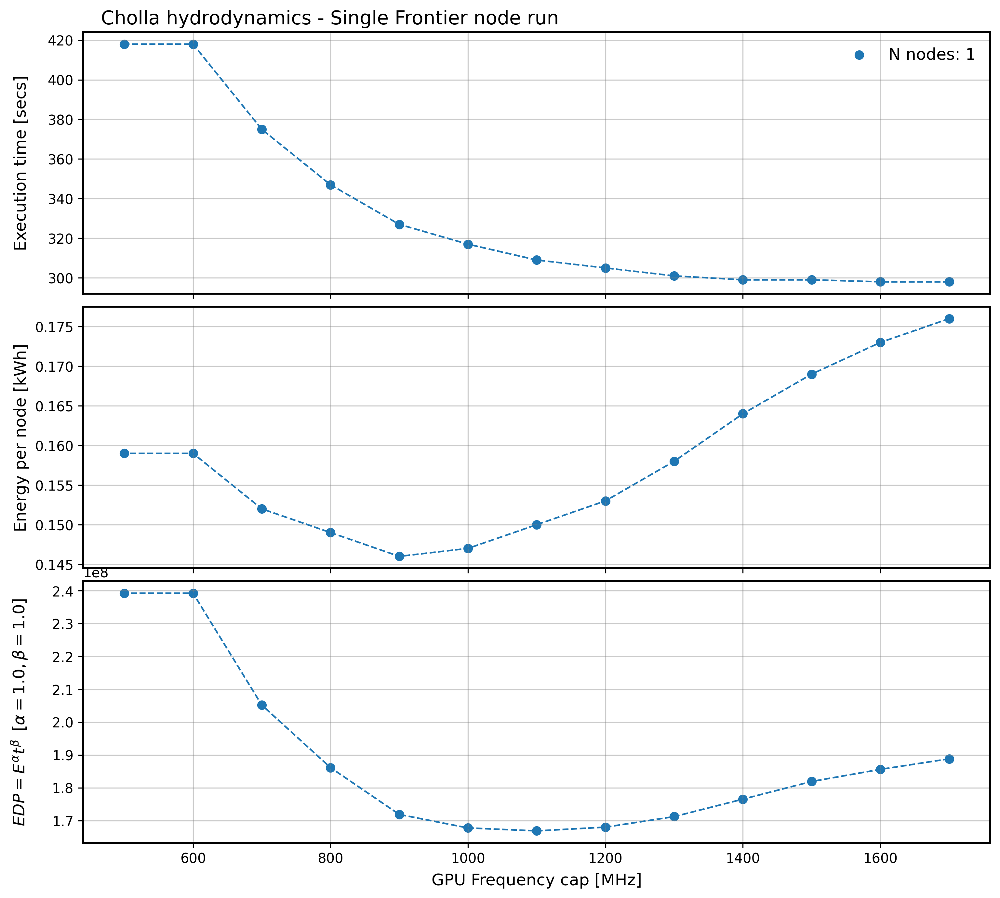

# Energy Efficiency Tools
Tools for energy efficiency related experiments


## Frequency sweep 

### Run on Frontier

The script `scripts/run_frequency_sweep.slurm` provides an example to run a frequency sweep study of an application on Frontier. The example runs a [Cholla](https://github.com/cholla-hydro/cholla) hydrodynamics simulation using the 8 devices on a Frontier node.

The script will iterate over several GPU frequency caps from 1700 to 700 MHz and it will run the application for each frequency cap. Additionally, the script runs an instance of [Omnistat](https://github.com/AMDResearch/omnistat) for telemetry data collection.

In principle, the script should be easily modifiable to run other applications by editing the options at the top of the script. The main variables to change in the script are:

- **N_MPI**: The total number of MPI ranks for the run
- **EXEC**: The application executable followed by the application parameters (for example input parameter file)
- **AFFINITY**: Affinity options, for example the number of cores per thread and the GPU affinity options.  


During runtime, a directory is created for each frequency cap (for example `maxsclk_1400` for frequency cap of 1400 MHz) where the application output, Omnistat data and energy and time counters are recorded.

### Plot the results

After running the script, you can use the `scripts/get_energy_analysis.py` Python script to gather and plot the data. To run the script you only need to pass the directory where the frequency sweep script was run.

Optional parameters are the values $\alpha$ and $\beta$ used to compute the Energy Delay Product defined as $EDP=E^\alpha t^{\beta}$, where $E$ is the energy used for the simulation in kWh and $t$ is the simulation execution time in seconds.

```bash
python scripts/get_energy_analysis.py --input_dir <FREQUENCY_SWEEP_DIRECTORY> --edp_alpha 1.0 --edp_beta 1.0
```

The output of the Cholla run on one Frontier node with $\alpha=1.0$ and $\beta=1.0$, looks like follows:

<p align="center">
  
</p>


